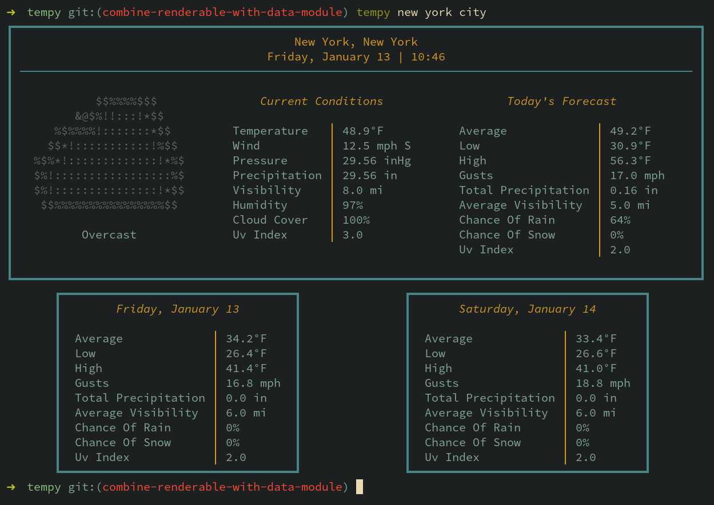

# tempy


`tempy` will render a simple, visually pleasing weather report for current and near-future conditions to your terminal.

`tempy` does not require an API key, but you can register one for yourself if you wish. See the section on [registering your own API key](#api-key-registry)

## Installation

You can install `tempy` using `pip`

```
pip install git+https://github.com/noprobelm/tempy
```

For Arch users, install the `tempy-git` package from the AUR 

## Usage

- Use `tempy new york city` to get the current weather for New York City

- Units are imperial by default. Specify the unit system you desire with the `-u` or `--units` flags: `tempy new york city -u metric` 



## Configuration

The first time you run `tempy`, a skeleton configuration file will be created in `$HOME/.config/tempyrc`.

`location`, `units`, and `api_key` can be specified. With `tempyrc` configured, you can generate a weather report simply by running `tempy` in your terminal.

## <a name='api-key-registry'></a> OPTIONAL: Register your own API key

By default, `tempy` makes requests to the [https://www.weatherapi.com](https://www.weatherapi.com/) API endpoint via my proxy server at [http://www.noprobelm.dev](http://www.noprobelm.dev). This is to prevent you from needing to register your own API key. 

If you'd rather not make requests through my server, you can always register your own key for free in minutes at [www.weatherapi.com](https://www.weatherapi.com/). Just store your key in `$HOME/.config/tempyrc` and `tempy` will take care of the rest. 

# Credits

- Credit due to [Will McGugan](https://github.com/willmcgugan) and the team at [textualize](https://www.textualize.io/) for creating such a wonderfully robust tool for rendering rich text to the terminal using Python.

# License

Copyright © 2023 Jeff Barfield.

