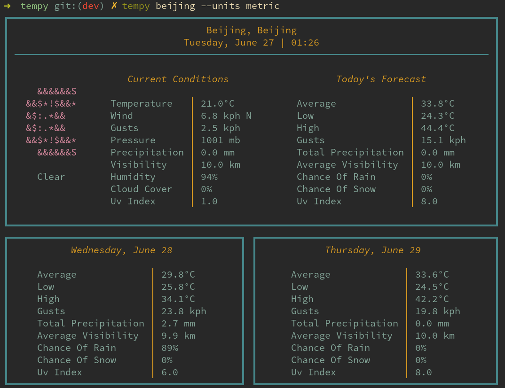

# tempy


`tempy` will render a simple, visually pleasing weather report for current and near-future conditions to your terminal.

`tempy` does not require an API key, but you can register one for yourself if you wish. See the section on [registering your own API key](#api-key-registry)

## Installation

```
pip install git+https://github.com/noprobelm/tempy
```

`tempy` is also available as `tempy-git` on the AUR.

## Usage

- Use `tempy nyc` to get the current weather for New York City

- Units are imperial by default. Specify the unit system you desire with the `-u` or `--units` flags: `tempy nyc -u metric` 



## Configuration

When `tempy` runs, a skeleton configuration file will be created in `$HOME/.config/tempyrc`. You can specify `location`, `units`, and `api_key` options in this file to make `tempy` run on a default set of arguments. 

## <a name='api-key-registry'></a> OPTIONAL: Registering your own API key

By default, `tempy` makes requests to the [https://www.weatherapi.com](https://www.weatherapi.com/) API endpoint via my proxy server at [http://www.noprobelm.dev](http://www.noprobelm.dev). This is to prevent you from needing to register your own API key. 

If you'd rather not make requests through my server, you can always register your own key for free in minutes at [www.weatherapi.com](https://www.weatherapi.com/). Just store your key in `$HOME/.config/tempyrc` and `tempy` will take care of the rest. 

# License

Copyright © 2023 Jeff Barfield.

